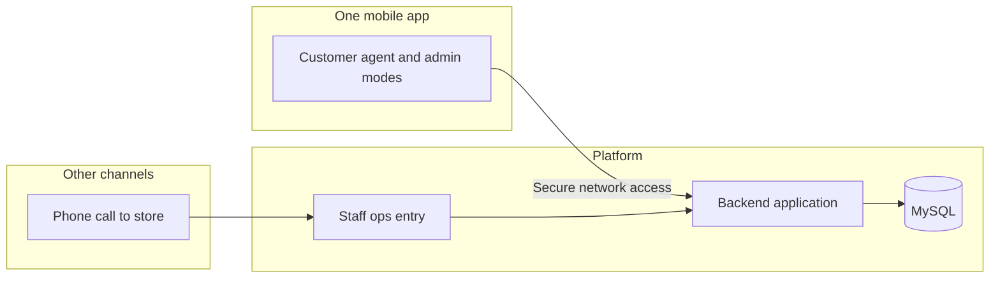

# DUKA — Project specification (high level)

This document describes **what the product is**, **how the business is intended to work**, and **which technologies we use** at a high level. It is shared context for everyone working on the project.

**Detailed design** — API shapes, authentication mechanisms, response formats, environment variables, and code-level conventions belong in the **frontend** and **backend** folders (and their own docs) as those parts are built. This file will be **extended over time** as the product evolves.

---

## 1. What this project is

**Working name:** Ammo Bag Store (branding can change; **DUKA** is a convenient project codename.)

DUKA is a **grocery delivery** initiative focused on getting orders to customers **the same day**, with special attention to **rural and semi-rural** areas—where finding addresses, staying reachable online, and running reliable delivery are often harder than in dense cities.

**Simplicity first:** Many users in villages may **not read comfortably** or prefer not to rely on text. The experience must stay **very simple and straightforward**—large clear steps, minimal jargon, and strong support for **voice** and **human help** (phone), not only traditional “type and tap” shopping.

**Languages:** The **app** supports **English** and **Hindi** so everyone using it—customers, agents, and admins—can use the interface in the language they are comfortable with (exact switching behavior—device default vs in-app toggle—is for the mobile documentation).

The first version of the product is **grocery only**. Later phases may add other services (for example **service booking** or **car booking**); those are **not** part of the initial scope but the overall direction should stay open enough to grow.

**One mobile app, three audiences:** The **same** React Native app is used by **end customers**, **delivery agents**, and **admins**—not separate store, driver, and admin apps. How each role experiences the app after sign-in is described in **§3**.

---

## 2. Business use case (why it exists)

- **Customers** need groceries without traveling long distances or waiting days; **same-day** delivery is the core promise where operations allow it.
- **Rural context** means we care about clear delivery instructions, realistic time windows, and honest communication when a slot or area cannot be served.
- **Access:** The product must work for people who are **not comfortable reading long text**—favor icons, short labels, optional **speech** (“say what you need”), and the ability to **place an order by phone call** so nobody is forced through a complex app-only flow. **All app-facing copy** should be available in **English** and **Hindi**.
- **Operations & control:** **Admins** configure catalog, users, inventory oversight, and role assignment (including delivery and future seller/vendor roles); **agents** execute deliveries; **customers** place orders—all through the **same** app where their role allows.
- **Future-ready commerce model:** The architecture should support onboarding **vendors/sellers**, **product owners/inventory managers**, **second-hand listings**, **vehicle-related offerings**, and **bookable services** in later phases without replacing the core app.
- Over time, the same platform might support **more than groceries**; for now, success means proving **reliable same-day grocery** in the chosen areas.

---

## 3. Who uses the mobile app (roles and sign-in)

### One app, three roles

| Role | Purpose (high level) |
|------|----------------------|
| **End customer** | Browse, order (including voice / phone-assisted flows), track orders, receive deliveries. |
| **Delivery agent** | See assigned runs, navigate, mark picked up / delivered, support cash-on-delivery handoff as the business defines it. |
| **Admin** | Manage catalog, orders, inventory oversight, and **which users** may act as delivery agent, vendor/seller, product owner/inventory manager, or admin (role assignment is done on the **backend / admin** side, not by the customer). |

### Sign-in and default behavior

- Users authenticate with their **mobile number** (exact mechanism—e.g. OTP—is for the backend and mobile docs).
- **Every user is an end customer by default.** New sign-ups need no special flag to shop; they should **land on the customer home** (shopping entry) when that is their **only** active role.

### Assigning roles (backend)

- **Admins** (via backend tools you provide) can designate specific users as **delivery agent** and/or **admin**, in addition to their baseline **customer** identity.
- In later phases, admins can also assign roles like **vendor/seller** and **product owner/inventory manager** as those capabilities are introduced.
- A person may therefore hold **one role** (customer only) or **several** (e.g. customer + agent, customer + admin, or more than two roles).

### When to ask “who are you using the app as?”

- If the signed-in user has **only** the **customer** role → **do not** show a role chooser; go **directly to the customer home page**.
- If they have **more than one** role → after sign-in, show a **short choice** in **English and Hindi**, for example:
  - **Customer + delivery agent:** “Continue as **customer**?” vs “Continue as **delivery agent**?”
  - **Customer + admin:** “Continue as **customer**?” vs “Continue as **admin**?”
  - **Customer + delivery agent + admin:** offer **all three** options so they pick the mode for this session.

The option they pick opens the right **home / dashboard** (shopping vs delivery work vs admin). Whether they can **switch mode** later without signing out again is a product detail for the mobile documentation; the intent is one install, multiple hats.

---

## 4. How the business flows (conceptual)

Customers can get groceries onto a **same-day delivery** path in more than one way:

### Ways to place an order

1. **Phone call** — Customer calls a **business phone number**; staff confirms the list and address (or follow-up call). No smartphone required. The order still lands in the same operational pipeline as app orders.
2. **Voice in the app** — Customer uses a **speech feature**: tap to speak **what they want** (e.g. items and quantities in natural language). The app or backend turns that into an order line-up over time as the product matures; early versions may combine voice with a simple review step.
3. **Search / browse and cart** — Customer **finds groceries** (search or categories), **adds to cart**, and confirms delivery details—similar to familiar shopping apps, but kept as **simple** as possible.

### After the order

4. **No online payment (initial phase)** — We **do not integrate a payment gateway for now**. Payment is expected **when the order is delivered** (e.g. cash or whatever the business accepts at the door). Online payments can be added in a **later phase** when needed.
5. **Fulfillment** — Once the order is placed (by phone, voice, or app), the team **prepares and goes to deliver**—same-day, within the rules you set for area and capacity.
6. **Aftercare** — Order status and updates can grow over time (notifications, callbacks, etc., as you add them).

Exact rules (cutoff times, fees, minimum order, which areas are served) are **business decisions** to document as you lock them in; they can be summarized in future updates to this spec or in internal ops docs.

---

## 5. Scope

### In scope (first phase)

- **Same-day grocery delivery** as the primary experience.
- **Initial rollout area:** Start in the home village with service limited to a **maximum 5 km radius** from the inventory point (dark store / dark house).
- **Very simple UX** oriented toward village users, including those with **low literacy**—minimal steps, clear visuals, and **voice** plus **phone ordering** as first-class options alongside browse/search and cart.
- **Bilingual app (English + Hindi)** for screens, labels, and key messages; extend to more languages only when the business chooses to.
- **Android-first** mobile app; the same React Native codebase can later support iOS if desired.
- **Single app for customer, delivery agent, and admin** with **mobile-number** sign-in, **customer as default**, **backend-assigned** agent/admin roles, and a **role picker** only when the user has **more than one** role (see **§3**).
- A **backend** that stores and serves the data the business needs (catalog, orders, delivery constraints, etc.) using **Node.js**, **Express**, and **MySQL**.
- **Pay on delivery** — **No payment gateway** in the first phase; money is collected **when you deliver** (unless the business later chooses otherwise).
- **Simple operations over complex automation:** In the initial phase, prioritize practical same-day execution and manual coordination (calls/in-person updates) over advanced real-time technology.
- **Delivery accountability:** Track which agent has which order, whether it is delivered or not delivered, and basic delivery performance at an operational level.

### Out of scope (initially)

- **Integrated online payment** (gateways, in-app card/UPI checkout) — **later phase**, when the business is ready.
- **Advanced real-time architecture** (live streaming updates, heavy event systems, complex automation) — **later phase**, once scale requires it.
- **Service booking**, **car booking**, and other non-grocery verticals — planned for **later phases** only.

---

## 6. Future expansion direction (architecture intent)

The current app starts with same-day grocery, but the platform must remain extendable so future business lines can be added without rebuilding from scratch.

- **Multi-role model:** Beyond customer/agent/admin, the same identity and role framework should accommodate roles such as **vendor/seller**, **product owner/inventory manager**, and other operational roles.
- **Multi-business model:** Future offerings may include **second-hand products**, **vehicle-related listings**, **service booking**, and travel/manpower-style bookings.
- **Single-app principle:** Users continue using one app; role and feature visibility depends on backend-assigned permissions and active mode.
- **Domain separation:** Catalog, inventory, order/delivery, services, and vehicles should evolve as separate business domains that can share a common user and operations foundation.
- **Phased rollout:** Grocery remains the first production focus; additional lines are introduced incrementally when business readiness and operations are in place.
- **Keep phase-1 simple:** Build only what is needed to run operations reliably in the village; introduce higher-complexity technology later.

---

## 7. Technology stack (high level)

| Area | Direction |
|------|-----------|
| **Mobile app** | **React Native**, Android as the first priority. Tooling may include **Expo** or equivalent workflows depending on what the mobile folder standardizes on. |
| **Mobile capabilities** | Navigation between screens (including **separate areas** of the app for **customer**, **agent**, and **admin** flows), sensible state and data-fetching patterns, **maps / location** for addressing and delivery runs, **speech / voice input** for ordering in simple language, **internationalization (i18n)** for **English and Hindi** UI strings, and libraries that support delivery operations (exact packages are chosen in the frontend project). |
| **Backend** | **Node.js** with **Express** (or aligned frameworks documented in the backend folder). |
| **Data** | **MySQL** for persistent storage of business and operational data. |
| **Communication** | Mobile and server talk over the network using an approach agreed in the backend/mobile docs (e.g. REST-style APIs); **concrete endpoints and security details are not defined in this file**. |

Supporting services (**maps** providers, **push** notifications, **payment gateways** when added, **speech** services if used) will be listed here **when adopted**, still at a **conceptual** level unless you choose to keep even those only in subproject docs.

---

## 8. High-level architecture

**Ideas we keep in mind (not implementation prescriptions)**

- The **same** installed app serves **shoppers, delivery agents, admins, and future seller/inventory roles**; the **backend** decides which **extra roles** each mobile identity has.
- The **app** is not the only ordering channel—**phone orders** still flow into the same operational picture.
- The **backend** enforces business rules, keeps records, connects to the database, and supports **admin actions** such as role assignment.
- Initial operations may rely on **manual communication** when exceptions occur (for example stock issues or delivery changes), while the platform still keeps core order and assignment records.

---

## 9. Conceptual building blocks

These are **domains of the business**, not database designs. How they are modeled in code and SQL belongs in the backend documentation.

- **People & access** — **Mobile-number** identities; **customer** is the default role for everyone. **Admins** (via backend) may grant **delivery agent**, **admin**, and future roles such as **vendor/seller** and **product owner/inventory manager**. The mobile app shows a **role choice** only when more than one role applies, then routes to the right experience (see **§3**).
- **Places** — Where we deliver; how we capture rural-friendly addresses and service areas.
- **Catalog** — What we sell, availability, and pricing as the business defines it; product names and descriptions may be offered in **English and/or Hindi** where it helps shoppers (details in backend/catalog docs).
- **Inventory operations** — Stock visibility and monitoring for roles responsible for supply (initially admin-led, later extendable to product owner/vendor roles).
- **Orders** — From **phone**, **voice request**, or **app cart** to a confirmed order through delivery outcome (one pipeline for ops).
- **Delivery & time** — Same-day promise, slots or windows, and capacity so we do not over-promise; include assignment and delivery-status tracking per agent.
- **Agent experience** — Delivery-agent mode should stay minimal: only assigned orders, delivery address/location, due time window, and short delivery notes/comments required to complete the job.
- **Payments** — **Initially:** no in-app gateway; **payment at delivery**. **Later:** online payments when the business adopts them; compliance follows whatever channels you enable.
- **Future domains** — Services, vehicles, and second-hand marketplace flows can be added as separate business modules while reusing the same user/role foundation.

---

## 10. Rural and same-day considerations (product)

- **Literacy-friendly design:** Favor **icons**, **short words**, **voice**, and **phone** so users are not blocked by reading long screens. Any “review order” step should stay as short as possible.
- **English and Hindi:** Keep terminology simple in both languages; **voice** flows should work naturally for **Hindi** (and English) as far as the product roadmap allows—specific speech tech is defined in the mobile docs.
- **Location-first entry (initial phase):** On first landing, ask users to enable location so serviceability can be checked early and clearly.
- **5 km service gate:** If the user is **within 5 km** of the dark store, allow browsing and booking. If the user is **outside 5 km**, show a clear “service not available yet, coming soon” message.
- **Addresses:** Prefer workflows that work when street maps are incomplete—landmarks, village names, and a reachable phone for the rider.
- **Connectivity:** Expect uneven networks; the product should fail gracefully (exact behavior is for the mobile spec).
- **Same day:** Tie the promise to **real operational limits** (slots, geography, order cutoffs)—document the actual rules as the business finalizes them.
- **Agent assignment flow (initial phase):** Orders are assigned to agents by operations/admin. Agent mode shows only job-critical details (where to deliver, by when, and comments).
- **Agent alerts:** When a new order is assigned, provide a simple attention signal (e.g., ring/tone/notification) so the agent notices quickly.
- **Communication:** Prefer simple status updates plus **call-back/phone** coordination in phase-1; richer real-time experiences can be added later.

---

## 11. Where to put deeper detail

| Topic | Where it should live |
|--------|----------------------|
| AI governance rules | `.cursor/rules/*.mdc` |
| Feature-level planning, tasks, and traceability | `docs/features/<feature-slug>/` |
| Screens, UX flows, client libraries | Frontend / mobile folder documentation |
| APIs, database schema, server structure, secrets & config | Backend folder documentation |
| This file | Vision, scope, business flow, stack at a glance, architecture diagram |

---

## 12. Maintaining this document

- Update **scope** and **business flows** when priorities change.
- Add **new technology choices** (e.g. payment provider when you add one) as short, high-level bullets.
- Avoid turning this file into an API reference or coding standard—those stay next to the code.

---

*Last updated: 2025-03-21 — phase-1 simplicity first (no heavy real-time), one app with role-based growth path, English + Hindi, pay on delivery, 5 km village rollout, and clear delivery-agent assignment/status tracking; high-level only.*
