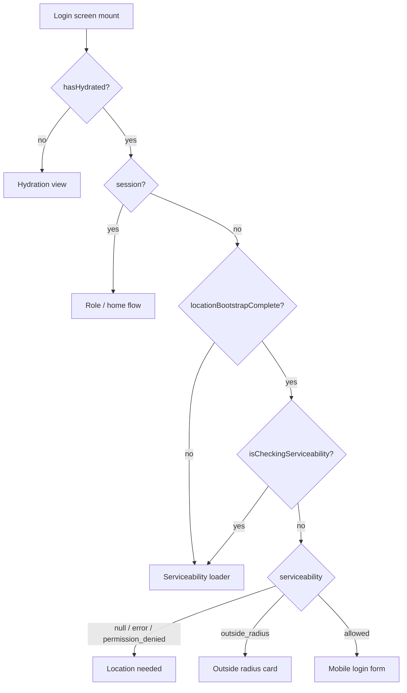

# Guest location access and serviceability (technical)

**Status:** Active  
**Last updated:** 2026-03-22  
**Scope:** React Native (Expo) guest flow on the login root screen — location permission, device location services, distance check vs hub, caching, and UI routing.

---

## Context

Before a guest can enter a mobile number, the app checks whether delivery is plausible for their current area. That requires a one-time (or cached) read of the user’s coordinates, compared to a configured hub and radius. Location can fail for several distinct reasons (permission denied, OS location off, GPS errors, user outside radius). This document lists those situations and how the current code behaves.

## Goal

- Give engineers a single reference for **guest** location + serviceability behavior (not logged-in users).
- Make it obvious which files implement which rules.

## Scope

| In scope | Out of scope |
|----------|----------------|
| Guest bootstrap, cache, `AppState` revalidation | Background location / tracking |
| `ServiceabilityResult` and login screen routing | Server-driven serviceability |
| `expo-location` foreground permission + `hasServicesEnabledAsync` | Agent or admin role-specific location flows |

## Assumptions

- Hub coordinates and radius come from `Frontend/src/config/appConfig.ts` (`serviceability.hubLocation`, `serviceability.radiusKm`).
- Guest snapshot is stored only on device (`AsyncStorage`), not on the server.
- Logged-in users skip guest serviceability bootstrap on the same screen (`app/index.tsx`).

## Source files (map)

| Area | Path |
|------|------|
| Login orchestration (effects, cache, `AppState`) | `Frontend/app/index.tsx` |
| Screen routing from state | `Frontend/src/features/auth/utils/loginScreenDecision.ts` |
| Permission + coordinates | `Frontend/src/services/location/locationService.ts` |
| Distance vs hub | `Frontend/src/services/serviceability/serviceabilityService.ts` |
| Guest snapshot persistence | `Frontend/src/services/serviceability/serviceabilityCache.ts` |
| UI: loading / permission / outside / login | `Frontend/src/commonUI/ServiceabilityLoader.tsx`, `AuthPermissionCard`, `AuthOutsideRadiusCard`, `AuthLoginForm` |

---

## Concepts

### `isGuestLocationAccessSatisfied()`

Defined in `locationService.ts`. Returns `true` only when **both** are true:

1. `getForegroundPermissionsAsync()` → `granted`
2. `hasServicesEnabledAsync()` → `true` (device-level location services on)

This avoids treating the user as “location OK” when the app has permission but the user turned off system location (a common cause of showing the login form instead of “Location needed”).

### `ServiceabilityResult`

From `serviceabilityService.ts`:

| `status` | Meaning |
|----------|---------|
| `allowed` | Within `radiusKm` of hub |
| `outside_radius` | Outside radius; includes `distanceKm` |
| `permission_denied` | No coordinates (typically permission not granted after `requestForegroundPermissionsAsync`) |
| `error` | Thrown failure from location read (e.g. timeout / provider error), handled in `try/catch` |

### Guest snapshot cache

- **Key:** `@duka/serviceability_snapshot` (`serviceabilityCache.ts`)
- **Payload:** `{ savedAt: number, result: ServiceabilityResult }`
- **Max age:** 24 hours (`SNAPSHOT_MAX_AGE_MS`). Older snapshots are discarded and removed from storage.

---

## Use cases and handling

The table below is the intended behavior of the **current** implementation.

| # | Use case | What happens |
|---|----------|--------------|
| 1 | **No session; auth store not hydrated yet** | `decideLoginScreenDecision` → hydration view until `hasHydrated` is true. |
| 2 | **Session present** | Guest location bootstrap is skipped; `locationBootstrapComplete` is set true; flow continues to role selection / role home as applicable. No serviceability cache read for routing. |
| 3 | **Guest; `serviceability` state already non-null** | Bootstrap effect short-circuits (does not reload snapshot); `locationBootstrapComplete` stays true. |
| 4 | **Guest; bootstrap running; snapshot not yet applied** | `locationBootstrapComplete` false → serviceability loader until the async bootstrap `finally` runs. |
| 5 | **No snapshot on disk** | Nothing to restore; after bootstrap, `serviceability` stays `null` → permission / “Location needed” screen (`AuthPermissionCard`). |
| 6 | **Snapshot exists but older than 24h** | Cache cleared; no restore; same as row 5. |
| 7 | **Snapshot fresh; `isGuestLocationAccessSatisfied()` is false** | Cache cleared; snapshot not applied (e.g. permission revoked or OS location off). UI ends as row 5. |
| 8 | **Snapshot fresh; guest access satisfied** | `setServiceability(snapshot.result)` → allowed, outside_radius, or error/denied as stored. |
| 9 | **Restored or computed `permission_denied` or `error`** | Decision maps both to the same permission-style screen (`SERVICEABILITY_PERMISSION_VIEW`) so the user can retry via **Enable Location**. |
| 10 | **`outside_radius`** | Outside-radius card with distance and retry. |
| 11 | **`allowed`** | Mobile login form. |
| 12 | **User taps Enable Location / retry** | `runServiceabilityCheck` → `checkServiceability()` → `getCurrentCoordinates()` (requests permission + `getCurrentPositionAsync`), then persists result to snapshot. Loader while `isCheckingServiceability`. |
| 13 | **User grants permission but OS location services stay off** | `isGuestLocationAccessSatisfied()` is false → cached “allowed” is not restored (row 7). On foreground, row 14 can clear in-memory allowed/outside. |
| 14 | **App returns to foreground (`AppState` `active`); guest; bootstrap complete** | Re-runs `isGuestLocationAccessSatisfied()`. If false: clears cache and clears in-memory `allowed` / `outside_radius` (not `permission_denied` / `error` state objects) so UI can return to “Location needed” after changing settings. |
| 15 | **Coordinates throw inside `checkServiceability`** | `error` status; UI shows permission screen (retry path). |

---

## Flow (high level)

---

## Acceptance criteria (behavioral)

These are the behaviors this doc is meant to match; change the doc when product intent changes.

- [ ] Guest without a valid snapshot never sees the mobile login form before passing serviceability (allowed) or explicitly seeing outside-radius / permission UI as appropriate.
- [ ] Restoring a cached `allowed` result requires both foreground permission **and** device location services enabled.
- [ ] Snapshots older than 24 hours are not used.
- [ ] Returning from system settings with location disabled invalidates a previously shown `allowed` / `outside_radius` state for guests (foreground check).
- [ ] Logged-in session never blocked by guest snapshot loading.

---

## Open questions

- Should `error` vs `permission_denied` show different copy or actions (today both use the permission card)?
- Should hub/radius or TTL move to remote config for ops changes without an app release?
