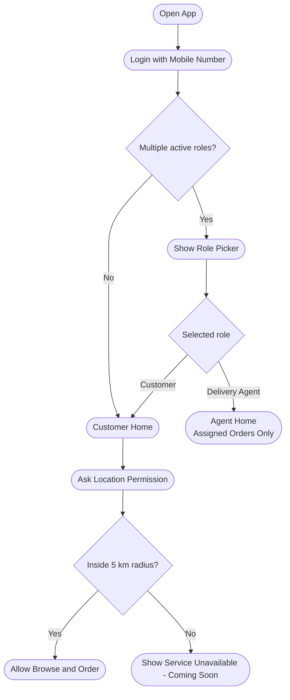

# Frontend Flow (Phase-1, Draft)

This is a simple, high-level flow for the mobile app.  
We will expand each step later with detailed screens and edge cases.

## Scope (for now)

- Mobile number login
- Role handling (customer default, role choice for multi-role users)
- Location gate (5 km service radius)
- Simple landing pages for each role

## Main user flow

Flow summary:
- Customer-only users go straight to customer home.
- Multi-role users select mode first (customer / delivery agent).
- Customer mode always passes through location + 5 km serviceability check.

## Notes

- Keep all role flows simple and easy to read.
- Agent mode should show only job-critical information.
- Detailed screen behavior will be documented later.
